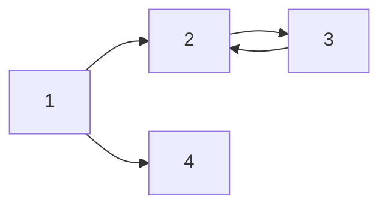

===
title: "MarkDown Test"
category:
    - hello
tag: 
    - markdown
toc


\#은 Header를 의미합니다.

# H1 태그 

## H2 Tag

### H3 Tag

#### H4 Tag


\#를 5개 이상 쓴다는 것? -> 잘못된 분류!! 


---

_italic_

**bold**

**_italic+bold_**

~~hello~~

> 오늘 너무 힘들다 - **안수빈**

---

* list 1
* list 2
* list 3
  - A
    - B

1. list 1
2. list 2
3. list 3
   1. A
      1. B

| 제목  | description | 비고  |
| -- | -- | -- |
| 안녕  | 1    | 2   |
| 할로  | 3    | 4   |
| 감사합니다. | 3 | 4


---

[subinium의 블로그](subinium.github.io)


---

`simple code`

```cpp
#include <stdio.h>

int main(){
    printf("hello world");
    return 0;
}
```

---

$ 1개는 문장 사이에 사용가능
$a^2_1 + b^2 = c^2$

$ 2개는 중앙에 배열

$$(\alpha + \beta)^2 = \alpha^2 + 2 \alpha \beta + \beta^2$$

---


